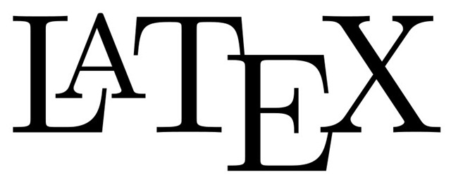

📚  Second-year student in computational physics at USP São Carlos

🔭 Creator of the scientific youtube channel [Singularidade](https://www.youtube.com/singularidade) 

✉️ Contact: My university email dutravinisousa2@usp.br

## Main Projects
* Added monte carlo error propagation in [LabIFSC](https://github.com/viniciusdutra314/LabIFSC)
* Anki language-learning cards quickly on [CardMaker](https://github.com/viniciusdutra314/Anki-CardMaker)
* Generating subtitles using Whisper Ai integrated with [Youtube](https://github.com/viniciusdutra314/Whisper-for-Youtube/) 
* ExtendScript repository to speedup video editing [Adobe Scripts](https://github.com/viniciusdutra314/Adobe-Scripts)
## Frontend 
<code></code>
<code></code>
<code></code>
<code></code>
<code></code>
<code></code>
## Backend
<code></code>
<code></code>
<code></code>
<code></code>
<code></code>

## Languages spoken
<code></code> Understands well, Reads well, Speaks well,  Writes well

<code></code> Understands well, Reads well,  Speaks Reasonably, Writes Reasonably

<code></code> Understands Reasonably,  Reads well, Speaks basically, Writes basically
